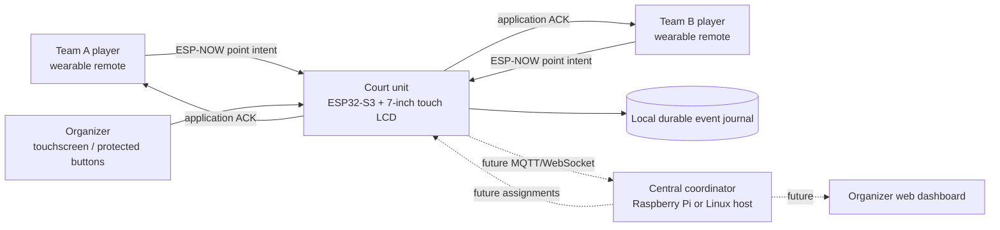
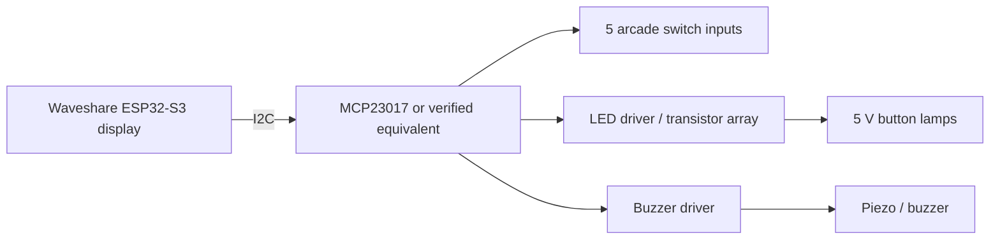
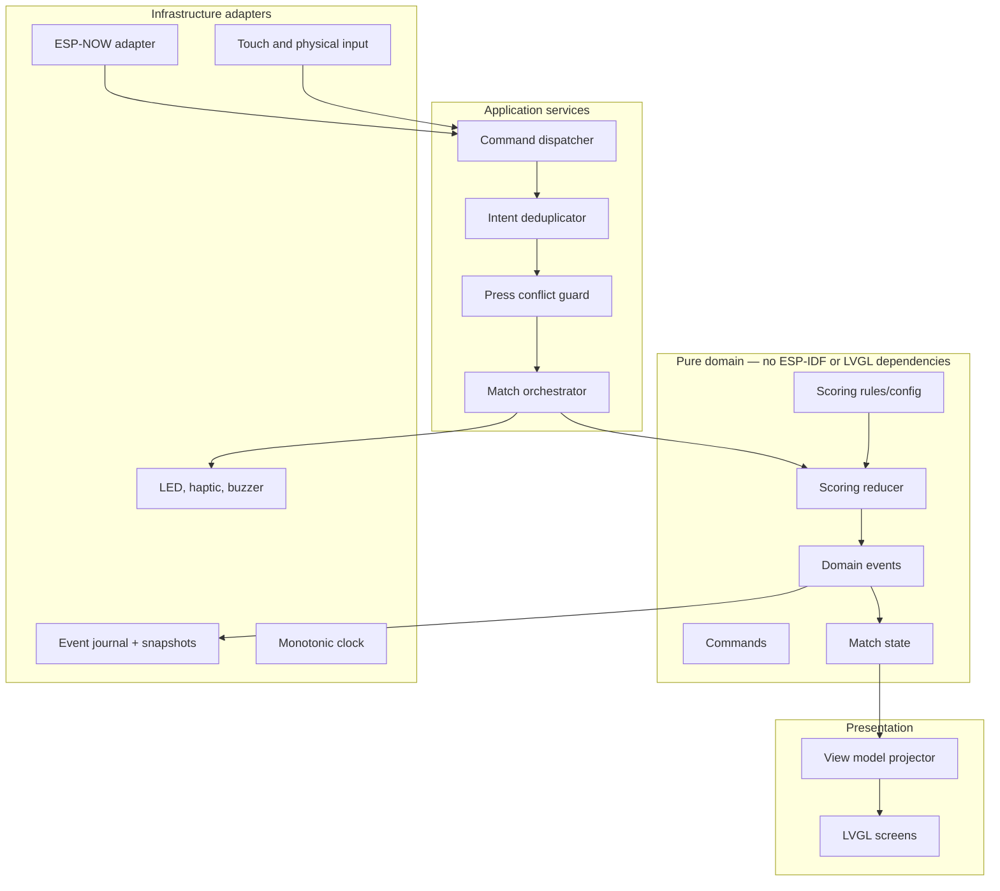
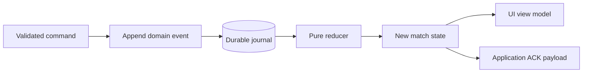
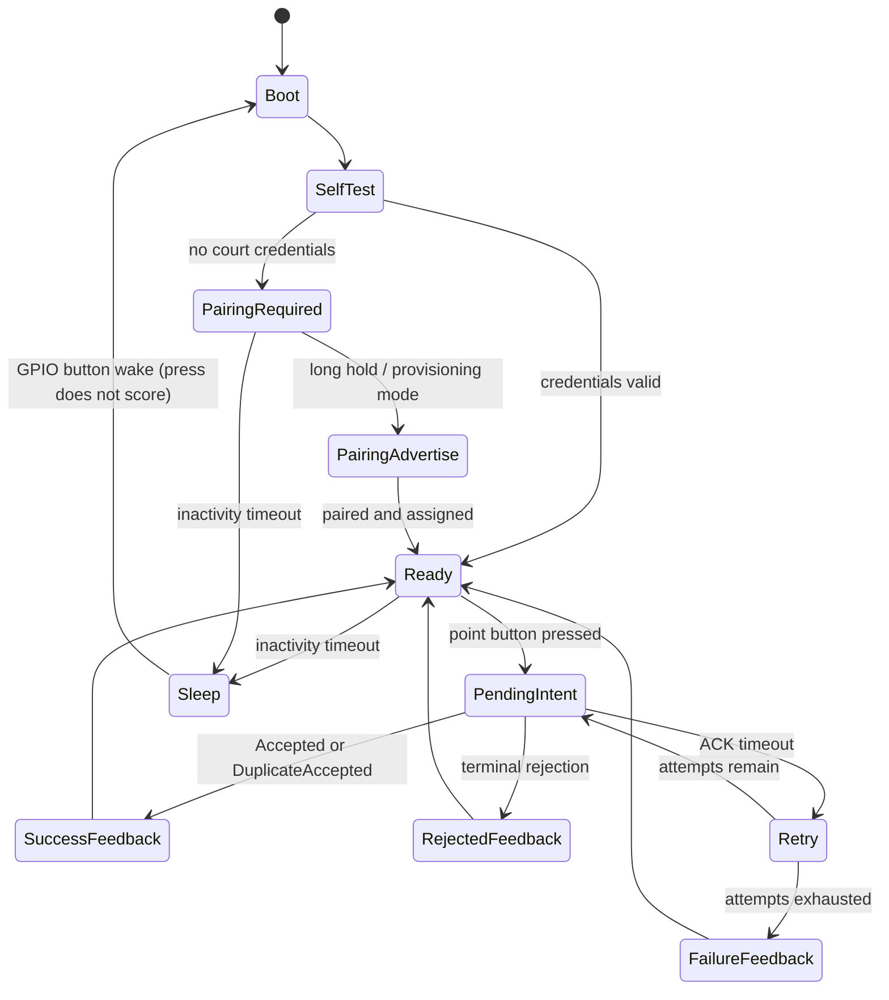
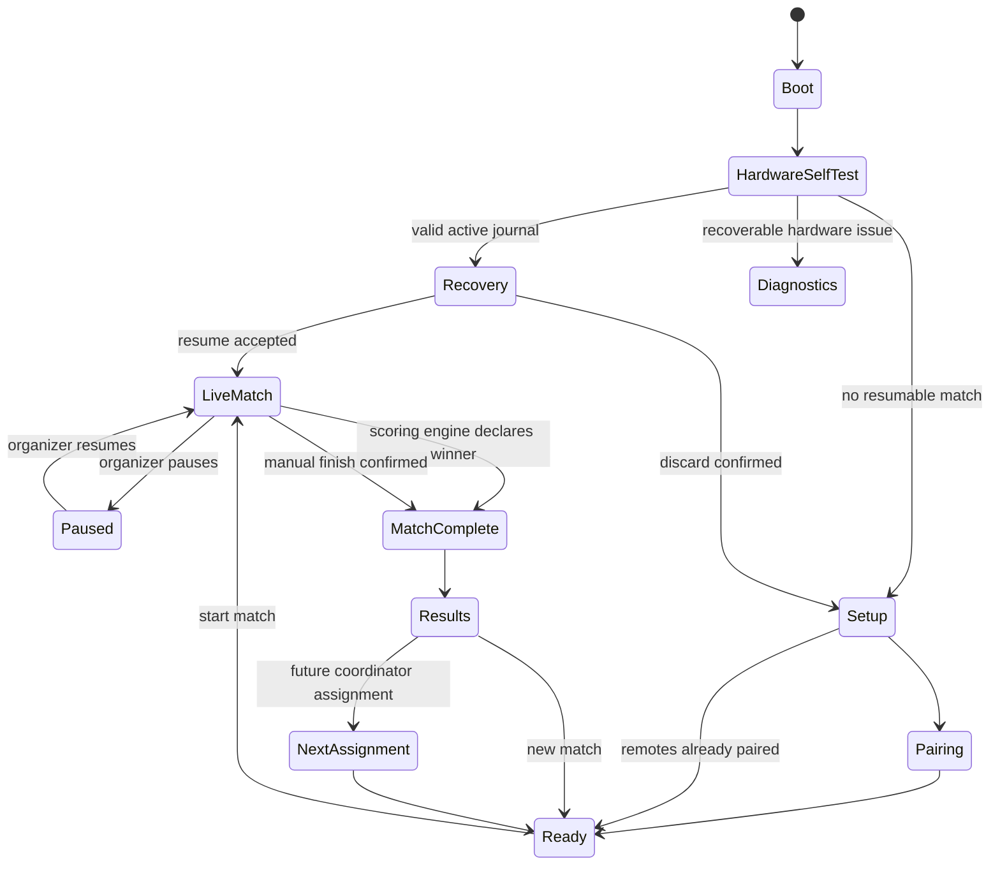
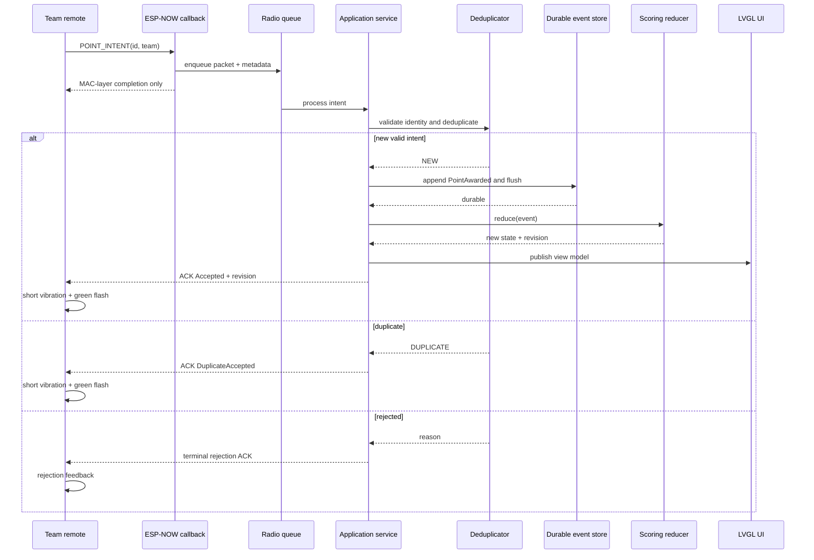
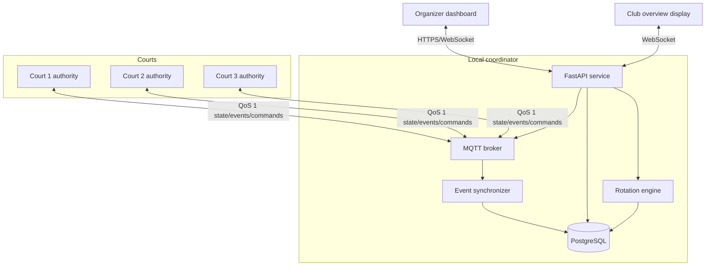
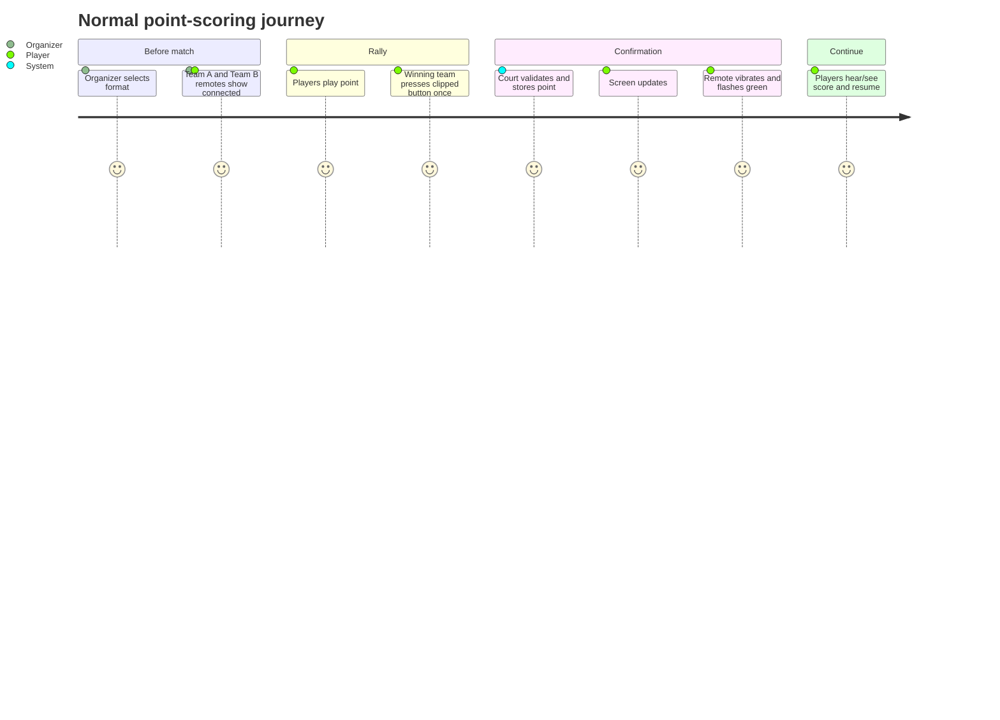

# PADEL SMART COURT — MASTER IMPLEMENTATION SPECIFICATION FOR AI AGENTS

> This file is intended to be read primarily by Cursor and other coding agents. Read it completely before making architectural decisions or modifying the repository. Treat the keywords **MUST**, **MUST NOT**, **SHOULD**, **SHOULD NOT**, and **MAY** as normative requirements.

## 0. AGENT OPERATING DIRECTIVE

This document is the source of truth for product intent, architecture, behavior, constraints, and acceptance criteria.

Every agent working in this repository MUST:

1. Inspect the existing repository before writing code.
2. Determine the current milestone from `STATUS.md` and the task list in this document.
3. Make the smallest coherent implementation increment that advances the active milestone.
4. Preserve the separation between domain logic, hardware abstraction, transport, persistence, and UI.
5. Run all relevant tests and at least one supported build before declaring work complete.
6. Update `STATUS.md`, `DECISIONS.md`, and any affected hardware documentation after meaningful changes.
7. Record assumptions instead of silently inventing hardware facts.
8. Never guess GPIO mappings. Verify them against the exact purchased board revision and official schematic before producing a wiring table.
9. Keep the system usable without internet, club Wi-Fi, a Raspberry Pi, a phone, or a cloud account.
10. Avoid broad rewrites when a localized change is sufficient.
11. Do not leave pseudocode, empty handlers, TODO-only production paths, fake acknowledgements, or untested scoring transitions in the active milestone.
12. Do not upgrade framework or library major versions merely because newer versions exist. First establish a working vendor baseline, then pin versions.
13. Prefer deterministic, testable code over clever code.
14. Treat duplicate point registration as a critical defect.
15. Treat loss of an accepted point after power interruption as a critical defect.
16. Treat any remote action capable of silently resetting a match as a critical UX defect.

Priority order when requirements conflict:

```text
1. Score correctness and exactly-once behavior
2. Safety and non-destructive UX
3. Offline reliability
4. Fast, obvious feedback to players
5. Maintainability and testability
6. Visual polish
7. Power optimization
8. Future multi-court extensibility
```

Do not block software progress on unresolved enclosure or pinout details. Use interfaces, simulator implementations, and board profiles so those decisions can be completed later without rewriting the domain.

---

# 1. PRODUCT VISION

Build a polished padel scoring system in which one player from each team clips a small wireless button to their shorts, waistband, pocket, or shirt. After a rally, the player on the team that won the point presses the button once. The court scoreboard updates automatically, provides audible and visual confirmation, and the wearable button confirms acceptance through vibration and/or LED feedback.

The player experience must be:

```text
Win rally -> press once without looking -> feel confirmation -> continue playing
```

Players must not need to:

- walk to the fence after every point;
- touch a phone;
- open an application;
- remember the current numerical score manually;
- pair Bluetooth devices before every match;
- interact with a menu during normal play.

The first deliverable is one complete court that works independently. The long-term product is a smart-court system spanning several courts, coordinating live scores, match completion, promotions/relegations, partner changes, and next-court assignments.

## 1.1 Core product promise

A point press that receives an acceptance confirmation MUST be reflected exactly once in the authoritative score and MUST survive a court-unit reboot or accidental power interruption.

## 1.2 Primary users

### Player

- Carries one remote for the team.
- Performs only one ordinary action: press to award the team a point.
- Receives immediate confirmation.
- Does not have destructive controls.

### Organizer

- Sets up the match.
- Assigns Team A and Team B remotes.
- Selects scoring format.
- Can undo, correct, pause, finish, or reset through protected court controls or an organizer interface.
- In the future, starts a multi-court session and approves automatic rotations.

### Club administrator

- Configures courts and device identities.
- Reviews device health and firmware versions.
- In the future, manages central services, player lists, sessions, and displays.

---

# 2. SCOPE

## 2.1 Phase P0: one polished standalone court — REQUIRED NOW

The P0 system consists of:

- one 7-inch ESP32-S3 touch display acting as the court authority;
- two wearable wireless remotes, one assigned to Team A and one to Team B;
- one physical button on each wearable remote;
- immediate remote feedback after an accepted point;
- a high-contrast live scoreboard;
- standard padel scoring plus configurable quick-set support;
- protected undo and reset controls on the court unit;
- local persistence and crash recovery;
- a local diagnostics and pairing screen;
- optional wired arcade buttons as backup/service controls;
- no dependency on internet, cloud, phone, or central Raspberry Pi.

## 2.2 Phase P1: multi-court local coordinator — FUTURE, ARCHITECT FOR IT

The P1 system adds:

- multiple independent court units;
- a Linux coordinator, initially expected to be a Raspberry Pi or equivalent;
- player/session registration;
- live overview of every court;
- automatic next-court and partner assignments;
- configurable two-court and three-court rotation policies;
- manual organizer override;
- offline synchronization from courts to coordinator;
- session history and basic ranking/analytics.

## 2.3 Explicit non-goals for P0

Do not implement these before P0 acceptance unless they are needed to preserve architecture:

- video recording or line calling;
- computer vision;
- public cloud accounts;
- payment or booking integration;
- public player rankings;
- mobile applications;
- voice recognition;
- complex tournament brackets;
- custom PCB production;
- over-the-air firmware updates;
- weatherproof certification;
- final injection-molded enclosure;
- individual-player shot statistics;
- individual server-order enforcement.

---

# 3. SYSTEM CONTEXT



## 3.1 Authority model

The court unit is the sole authority for the active court match.

The remote sends an **intent** such as `AWARD_POINT_TEAM_A`; it never sends or calculates the score. The court unit validates, deduplicates, durably records, applies, renders, and acknowledges the intent.

The future central coordinator is not in the critical scoring path. A court must continue scoring if the coordinator or network disappears.

## 3.2 Required invariants

1. One accepted intent produces exactly one domain event.
2. Repeated transmission of the same intent never produces a second point.
3. A remote receives `ACCEPTED` only after the event is durable enough to recover after reboot.
4. A remote receives `DUPLICATE_ACCEPTED` for a replay of an already-applied intent.
5. A reset cannot be triggered by a normal wearable click.
6. Undo is represented by a new compensating event; prior history is not deleted.
7. UI state is derived from authoritative domain state, not maintained independently.
8. Network loss does not make scoring unavailable.
9. UI rendering or storage work is never performed directly inside the ESP-NOW receive callback.
10. The same scoring reducer must be testable natively without ESP32 hardware.

---

# 4. HARDWARE BASELINE

## 4.1 Court display/controller

Preferred target:

```yaml
component: court-display
preferred_board: Waveshare ESP32-S3-Touch-LCD-7B
required_variant: capacitive-touch version
screen_size: 7 inch
resolution: 1024x600
mcu: ESP32-S3
memory_target: 16 MB flash, 8 MB PSRAM
power: 5 V over USB-C
```

Supported alternate target:

```yaml
component: court-display
alternate_board: Waveshare ESP32-S3-Touch-LCD-7
required_variant: capacitive-touch version
screen_size: 7 inch
resolution: 800x480
mcu: ESP32-S3
power: 5 V over USB-C
```

The UI MUST be responsive across both `800x480` and `1024x600`. Do not encode the entire layout using fixed pixel coordinates. Use percentages, flex/grid layout, and a small set of resolution-dependent design tokens.

The agent MUST begin board integration from the official Waveshare example package for the exact model. Establish a minimal display/touch baseline before adding product logic.

## 4.2 Wearable remotes

Each team receives one remote.

Preferred prototype controller:

```yaml
component: wearable-remote
board: Seeed Studio XIAO ESP32-C3
quantity: 2
radio: 2.4 GHz Wi-Fi using ESP-NOW
power_input: protected 3.7 V LiPo
charging: onboard USB-C / battery management supported by board
primary_input: one momentary button
feedback:
  - RGB or bi-color LED
  - coin vibration motor or haptic actuator
mechanical:
  - compact enclosure
  - recessed or guarded press surface
  - strong belt/waistband/shirt clip
  - optional lanyard point
```

Remote A and Remote B use the same firmware image where practical. Team assignment MUST be runtime configuration or build-time configuration isolated in one board profile; do not fork the codebase.

### 4.2.1 Remote button

The wearable button is not the 100 mm dome button. That component is too large for clothing.

The wearable input SHOULD be:

- approximately 18–30 mm press surface;
- low-profile enough for a compact enclosure;
- easy to press without looking;
- recessed or guarded to reduce accidental activation;
- momentary, normally open;
- mechanically rated for repeated use;
- ideally splash-resistant.

A 30 mm arcade button MAY be used for an early bench remote, but its body depth and enclosure size must be evaluated before calling the wearable polished.

### 4.2.2 Vibration motor

A coin vibration motor MUST NOT be driven directly from an ESP32 GPIO. Use a suitable transistor or logic-level MOSFET and protection appropriate to the selected motor. Encapsulate the implementation behind `IHapticOutput`.

### 4.2.3 Battery

Use a reputable protected 3.7 V LiPo cell, initially approximately 300–500 mAh. Verify connector polarity before connecting. Do not assume all JST-style connectors use the same polarity.

The first firmware release MAY display battery state as `unknown` if reliable measurement hardware is absent. Do not fabricate a percentage from elapsed time.

## 4.3 Court-side physical buttons

The available 30 mm, 5 V illuminated arcade buttons are suitable for the court unit as backup and service controls.

Suggested mapping:

| Color | Default function | Normal-match behavior |
|---|---|---|
| Blue | Team A +1 backup | Award point to Team A |
| Red | Team B +1 backup | Award point to Team B |
| Green | Undo | Undo last reversible scoring action |
| Yellow | Start / confirm / next | Context-dependent, non-destructive |
| White | Menu / service | Open protected organizer menu |

Requirements:

- Switch contacts are logically separate from the 5 V lamp circuit.
- Switch input MUST use 3.3 V-safe GPIO or an input expander.
- Never connect a 5 V lamp terminal to an ESP32 GPIO.
- If lamps are software-controlled, use an appropriate transistor/driver stage.
- Long-press destructive actions require on-screen confirmation.
- Physical buttons are optional for initial UI development but required for the polished P0 enclosure if installed in the purchased design.

## 4.4 Recommended court I/O architecture

Because display boards consume many GPIOs, prefer an I2C GPIO expander rather than guessing free pins.

Recommended pattern:



This is a recommendation, not a license to assume the exact expander is present. The final wiring must be recorded in `docs/HARDWARE_PINOUT.md` after the exact parts and board revision are known.

## 4.5 Power

Court unit target:

- regulated 5 V source;
- USB-C supply or power bank;
- target capacity/current margin sufficient for display backlight, ESP32 radio, and peripherals;
- begin with a reputable 5 V / 3 A supply or power bank unless the exact board documentation requires otherwise.

Remote target:

- protected 3.7 V LiPo;
- USB-C charging through the selected board;
- active-match runtime target: at least 8 hours;
- standby target: at least 7 days after sleep optimization;
- power optimization occurs after communication reliability is proven.

## 4.6 Electrical safety constraints

- Never apply 5 V to an ESP32 GPIO.
- Never drive a motor directly from a GPIO.
- Never short a LiPo cell.
- Never solder or connect a battery without verifying positive and negative terminals.
- Never assume an illuminated button includes the resistor required for a different voltage.
- Use strain relief on wearable battery wiring.
- Keep exposed conductors away from sweat and metal clips.
- Do not claim weather resistance without an enclosure and component rating supporting it.

---

# 5. SOFTWARE STACK

## 5.1 Firmware framework

Use ESP-IDF as the primary framework because it provides official ESP32 support, FreeRTOS integration, ESP-NOW APIs, storage APIs, testing facilities, and production-oriented controls.

Version policy:

1. Download the official Waveshare example for the exact purchased board.
2. Identify the ESP-IDF and LVGL versions used by that example.
3. Build and flash the untouched example.
4. Record the proven versions in `docs/TOOLCHAIN.md`.
5. Pin those versions in the project.
6. Do not upgrade major versions until the board support layer and test suite are green.

Current upstream stable versions may be newer than the vendor example. Vendor compatibility takes precedence during bring-up.

## 5.2 Languages

- Firmware and shared domain code: C++17.
- C interoperability: only at framework boundaries.
- Build files: CMake / ESP-IDF component manifests.
- Future coordinator: Python with FastAPI, PostgreSQL, and MQTT, but not required for P0.
- Future web UI: select only when P1 begins.

## 5.3 UI

Use LVGL. The project MUST isolate Waveshare-specific display and touch initialization from application screens.

Required UI layers:

```text
Board display/touch driver
        ↓
LVGL port and display abstraction
        ↓
View models derived from domain state
        ↓
Screens and reusable widgets
```

Screens MUST NOT mutate score state directly. UI actions emit commands to the application service, which validates and emits events.

## 5.4 Native testing

The scoring engine, event reducer, protocol serializer, deduplicator, and rotation-policy interfaces MUST compile and run on the developer machine without ESP32 hardware.

Use one of:

- ESP-IDF host tests where practical;
- a dedicated native CMake target using Catch2, GoogleTest, or Unity;
- PlatformIO native environment only if it does not force framework coupling.

The test framework must be pinned.

---

# 6. REPOSITORY STRUCTURE

Create or converge toward this monorepo layout:

```text
/
├── AGENTS.md                         # Optional short pointer to this master spec
├── PADEL_SMART_COURT_MASTER_SPEC.md  # This document
├── README.md
├── STATUS.md
├── DECISIONS.md
├── CMakeLists.txt
├── firmware/
│   ├── court-display/
│   │   ├── CMakeLists.txt
│   │   ├── sdkconfig.defaults
│   │   ├── main/
│   │   └── board_profiles/
│   │       ├── waveshare_7/
│   │       └── waveshare_7b/
│   └── wearable-remote/
│       ├── CMakeLists.txt
│       ├── sdkconfig.defaults
│       ├── main/
│       └── board_profiles/
│           └── xiao_esp32c3/
├── components/
│   ├── domain/
│   ├── application/
│   ├── protocol/
│   ├── persistence/
│   ├── radio/
│   ├── ui/
│   ├── hardware_abstraction/
│   ├── diagnostics/
│   └── common/
├── simulator/
│   ├── scorer-cli/
│   └── radio-simulator/
├── tests/
│   ├── domain/
│   ├── protocol/
│   ├── persistence/
│   └── integration/
├── docs/
│   ├── HARDWARE_PINOUT.md
│   ├── TOOLCHAIN.md
│   ├── RADIO_PROTOCOL.md
│   ├── SCORING_RULES.md
│   ├── UI_STATES.md
│   ├── FIELD_TEST_PLAN.md
│   └── TROUBLESHOOTING.md
├── hardware/
│   ├── wiring/
│   ├── enclosure/
│   └── bom/
├── tools/
│   ├── flash.sh
│   ├── monitor.sh
│   ├── build_all.sh
│   └── generate_protocol_vectors.py
└── future/
    └── coordinator/
```

A simpler initial structure is acceptable, but domain and hardware code MUST remain separable.

---

# 7. COMPONENT ARCHITECTURE



## 7.1 Dependency rule

Dependencies point inward.

- `domain` has no dependency on ESP-IDF, FreeRTOS, LVGL, Waveshare code, or radio drivers.
- `application` depends on domain interfaces.
- adapters implement interfaces required by application/domain.
- UI observes projected state and sends commands.
- board profiles instantiate concrete drivers.

---

# 8. DOMAIN MODEL

## 8.1 Core identifiers

Use explicit typed identifiers rather than interchangeable integers where practical:

```cpp
using CourtId = uint16_t;
using MatchId = uint64_t;
using EventId = uint64_t;
using RemoteId = uint32_t;
using PlayerId = uint64_t;  // future coordinator
```

## 8.2 Team

```cpp
enum class TeamId : uint8_t {
    A = 1,
    B = 2,
};
```

Do not use display colors as identity. Team A may be rendered blue and Team B red by default, but identity must remain semantic and accessible.

## 8.3 Match configuration

Represent scoring format as data, not conditionals scattered throughout the UI.

```cpp
enum class GameRule : uint8_t {
    Advantage,
    GoldenPoint,
};

enum class FinalSetRule : uint8_t {
    FullSet,
    MatchTiebreak,
};

struct SetRule {
    uint8_t games_to_win = 6;
    bool win_by_two_games = true;
    bool tiebreak_enabled = true;
    uint8_t tiebreak_at_games = 6;
    uint8_t tiebreak_points_to_win = 7;
    bool tiebreak_win_by_two = true;
};

struct MatchConfig {
    GameRule game_rule = GameRule::Advantage;
    SetRule normal_set{};
    uint8_t sets_to_win = 2;
    FinalSetRule final_set_rule = FinalSetRule::FullSet;
    uint8_t match_tiebreak_points_to_win = 10;
    bool match_tiebreak_win_by_two = true;
    bool track_serving_team = true;
};
```

The exact type names may change, but the configuration must support:

1. Standard padel: advantage games, best of three sets, sets to six, tiebreak at 6–6.
2. Golden-point games.
3. Quick/mini set: configurable games to win, such as first to three.
4. Final-set match tiebreak to ten.

Points-only Americano and timed modes are P1/P2 extensions and should use a strategy interface rather than corrupting standard scoring logic.

## 8.4 Match state

Use raw numeric point counts internally. Display formatting derives `0`, `15`, `30`, `40`, `DEUCE`, and `AD` from those counts.

Illustrative shape:

```cpp
struct GameState {
    uint8_t raw_points_a = 0;
    uint8_t raw_points_b = 0;
};

struct SetScore {
    uint8_t games_a = 0;
    uint8_t games_b = 0;
    std::optional<uint8_t> tiebreak_points_a;
    std::optional<uint8_t> tiebreak_points_b;
};

struct MatchState {
    MatchId match_id{};
    MatchConfig config{};
    MatchLifecycle lifecycle{};
    TeamId serving_team{TeamId::A};
    GameState current_game{};
    std::vector<SetScore> completed_sets{};
    SetScore current_set{};
    uint8_t sets_won_a = 0;
    uint8_t sets_won_b = 0;
    uint64_t revision = 0;
    std::optional<TeamId> winner{};
};
```

Avoid unbounded dynamic allocation in hot firmware paths. A fixed-capacity container is acceptable because padel matches have bounded sets.

## 8.5 Commands

Commands express requested actions and may be rejected.

Required commands:

```text
CreateMatch
StartMatch
AwardPoint(team, source, intent_id)
UndoLastScoringAction(source)
SetServingTeam(team)
PauseMatch
ResumeMatch
FinishMatchManually
ResetMatch
AssignRemote(remote_id, team)
UnassignRemote(remote_id)
```

`ResetMatch` MUST require a protected organizer flow. It cannot be issued by a normal remote point press.

## 8.6 Domain events

Events represent accepted facts.

Required event categories:

```text
MatchCreated
MatchStarted
PointAwarded
GameWon
SetWon
TiebreakStarted
TiebreakPointAwarded
MatchWon
ScoringActionUndone
ServingTeamChanged
MatchPaused
MatchResumed
MatchFinishedManually
MatchReset
RemoteAssigned
RemoteUnassigned
```

It is acceptable for the reducer to generate a composite transition from one `PointAwarded` event, but externally visible milestones such as game/set/match completion should be either explicit events or reproducibly projected facts. Choose one approach and document it in `DECISIONS.md`.

## 8.7 Event-sourced state transition



Preferred order for remote-originated point:

```text
validate -> deduplicate -> resolve conflict guard -> append durable event -> reduce -> render -> ACK
```

Rendering may happen immediately after reduction; ACK must not claim acceptance before durability.

## 8.8 Undo semantics

Undo MUST append a compensating event referencing the scoring event being reversed.

Do not delete or mutate previous journal entries.

Undo must work across boundaries:

- point within a game;
- point that completed a game;
- point that completed a set;
- point that completed a match;
- tiebreak point;
- golden point.

After undoing a match-winning point, lifecycle returns to active match and the winner is cleared.

The simplest correct implementation is to replay the event journal while ignoring or compensating the referenced event. Optimize with snapshots only after correctness is proven.

---

# 9. PADEL SCORING RULES

## 9.1 Advantage game

Display mapping before deuce:

```text
raw 0 -> 0
raw 1 -> 15
raw 2 -> 30
raw 3 -> 40
```

For raw points where both teams have at least three:

```text
same raw count       -> DEUCE
one-point difference -> AD for leading team
two-point difference -> game won by leading team
```

A team also wins before deuce when it reaches at least four raw points with a lead of at least two.

## 9.2 Golden-point game

At 40–40, the next point wins the game. The display should show a clear golden-point state such as `GOLDEN POINT` rather than an advantage.

## 9.3 Standard set

Default:

- first to six games;
- must lead by two games unless the configured tiebreak threshold is reached;
- tiebreak at 6–6;
- tiebreak first to seven points, win by two;
- set score recorded as 7–6 after tiebreak.

## 9.4 Quick/mini set

The engine must support configurable `games_to_win`, `win_by_two_games`, and tiebreak threshold. Do not hardcode first-to-six assumptions.

Example club mode:

```yaml
name: mini-set-first-to-3
normal_set:
  games_to_win: 3
  win_by_two_games: false
  tiebreak_enabled: false
sets_to_win: 2
```

The final exact club rules remain configuration, not domain code changes.

## 9.5 Match

Default match is first to two sets. Final-set behavior is configurable between full set and match tiebreak.

## 9.6 Serving team

P0 may track serving **team** rather than individual server order.

Required behavior:

- organizer selects starting serving team;
- serving team changes at game boundaries;
- tiebreak serving display may initially be manual if full service-order logic is not implemented;
- do not display an individual server name unless the system actually tracks and validates it.

---

# 10. WIRELESS PROTOCOL

## 10.1 Transport

Use ESP-NOW encrypted unicast for normal operation.

Reasons:

- no access point required;
- no recurring user pairing workflow;
- low payload overhead;
- appropriate for remote-control intents;
- available on ESP32-S3 and ESP32-C3.

Normal scoring MUST NOT use unauthenticated broadcast packets.

## 10.2 Application-layer acknowledgement

A successful ESP-NOW send callback is not sufficient proof that the application processed the point. Implement an explicit application ACK from court to remote.

The remote retries the same intent identifier until it receives a terminal ACK or reaches its retry policy.

Terminal ACK statuses:

```cpp
enum class AckStatus : uint8_t {
    Accepted,
    DuplicateAccepted,
    RejectedNotInMatch,
    RejectedWrongTeam,
    RejectedUnpaired,
    RejectedPaused,
    RejectedConflict,
    RejectedInvalidPacket,
    ErrorStorage,
};
```

## 10.3 Packet design

Keep packets below 250 bytes for broad ESP-NOW compatibility.

Do not send raw packed C++ structs across the radio because of padding, endianness, compiler, and versioning risk. Implement explicit serialization and deserialization with bounds checks.

Suggested point-intent fields:

```text
magic               2 bytes  "PS"
protocol_version    1 byte
message_type        1 byte   POINT_INTENT
court_id            2 bytes
remote_id           4 bytes
boot_id             4 bytes
sequence            4 bytes
team_id             1 byte
action               1 byte   AWARD_POINT
button_duration_ms  2 bytes
battery_mv           2 bytes  0 if unknown
monotonic_ms         4 bytes
flags                1 byte
crc16                2 bytes
```

Unique intent identity:

```text
(remote_id, boot_id, sequence)
```

Suggested ACK fields:

```text
magic               2 bytes  "PS"
protocol_version    1 byte
message_type        1 byte   ACK
court_id            2 bytes
remote_id           4 bytes
boot_id             4 bytes
sequence            4 bytes
ack_status           1 byte
state_revision       8 bytes
team_a_display_code  compact projection
team_b_display_code  compact projection
crc16                2 bytes
```

The score summary in an ACK is optional but useful for diagnostics. The authoritative display remains the court screen.

## 10.4 Receive callback constraint

ESP-NOW callbacks execute in a high-priority Wi-Fi task context. The callback MUST:

1. validate only minimal framing needed to avoid unsafe data;
2. copy the packet and metadata into a bounded queue;
3. return quickly.

The callback MUST NOT:

- write flash;
- mutate LVGL;
- run the scoring reducer;
- block for an ACK;
- allocate large objects;
- log large formatted messages.

## 10.5 Retry behavior

Initial recommended retry schedule:

```yaml
ack_timeout_ms: 450
max_attempts: 5
backoff_ms: [0, 80, 180, 350, 650]
```

All retries use the same intent identity.

The remote MUST NOT generate the next sequence merely because the user pressed again while an intent is pending. A repeat press during the pending window retransmits or is ignored, preventing a lost ACK from becoming a second point.

## 10.6 Deduplication

Court unit deduplicates by `(remote_id, boot_id, sequence)`.

Requirements:

- keep a bounded recent-intent cache per remote;
- persist enough deduplication state that a court reboot immediately after acceptance does not apply a retried point twice;
- ACK a known duplicate as `DuplicateAccepted`;
- handle sequence wrap explicitly;
- reject stale or impossible version data;
- record duplicate counters for diagnostics.

## 10.7 Radio channel

P0 may use a fixed configurable 2.4 GHz channel, such as channel 6, but it MUST be a configuration value.

Future coexistence rule:

- when court Wi-Fi and ESP-NOW operate simultaneously, the Wi-Fi network and ESP-NOW peers must use a compatible channel strategy;
- central-network integration must not silently break remote scoring;
- if required, use a dedicated local access point configured to the same channel.

## 10.8 Security

Use non-default ESP-NOW PMK and per-peer LMK where supported.

- Never commit production keys to source control.
- Development keys may live in an ignored local configuration file.
- Pairing and key provisioning must be documented.
- Court maintains an allow-list of paired remote MAC addresses and logical remote IDs.
- A remote assigned to Team A cannot award Team B.

P0 pairing may begin with preconfigured peers, but the polished prototype should include a physical-presence pairing flow.

---

# 11. REMOTE FIRMWARE

## 11.1 Remote state machine



## 11.2 Button behavior

During an active match:

- one normal press = one point intent for the assigned team;
- a long hold still produces at most one point;
- double tapping must not produce two points because of switch bounce;
- no normal press or double-click resets or undoes the match;
- pairing mode is available only through a deliberate boot/hold gesture or enclosure service action.

Initial debounce parameters:

```yaml
stable_press_ms: 30
stable_release_ms: 30
local_retrigger_guard_ms: 700
```

These are tunable configuration values and must be verified with the selected button.

## 11.3 Feedback contract

Suggested remote feedback:

| Result | Haptic | LED |
|---|---|---|
| Accepted | one short pulse | green flash |
| DuplicateAccepted | one short pulse | green flash |
| RejectedConflict | two short pulses | amber/red alternating |
| RejectedNotInMatch / Paused | two medium pulses | amber |
| Communication failed | one long pulse | three red flashes |
| Pairing success | three short pulses | green sequence |
| Low battery, if measurable | none during scoring | brief red reminder after ACK |

Feedback patterns MUST be centralized in one module, not duplicated across handlers.

## 11.4 Power behavior

Implementation order:

1. Reliable always-awake remote on USB. **Done** (2026-08-05, both units).
2. Reliable battery-powered remote with light/modem sleep. **Open.**
3. Deep sleep after inactivity with button wake. **Done** — see ADR-0015.
4. Current measurement and runtime optimization. **Open.**

Do not optimize sleep before packet/ACK reliability is tested.

Step 3 was taken before step 2 deliberately: standby drain is the failure mode that actually strands a remote, and a deep-sleep wake is a reboot, a path already proven safe by the NVS sequence baseline and the deduplicator's fresh-`boot_id` rule. Step 2 remains worthwhile because it extends runtime *during* a match rather than between sessions.

Per ADR-0015, the press that ends deep sleep wakes the remote and does not score. A wake takes longer than a typical tap, so inferring a point from the wake cause would let an accidental knock in storage add one silently.

When using XIAO ESP32-C3 deep sleep, choose a wake-capable pin verified against official documentation and the actual board. Record it in `docs/HARDWARE_PINOUT.md`. Verified: GPIO0-5 only (`SOC_GPIO_DEEP_SLEEP_WAKE_VALID_GPIO_MASK`), and the point button on GPIO3 / pad D1 qualifies.

## 11.5 Remote persistence

Persist:

- remote logical ID;
- assigned court ID;
- assigned team;
- paired court MAC;
- radio channel;
- keys or key references;
- protocol version;
- last acknowledged sequence or safe sequence baseline.

Generate a random `boot_id` on each boot using a hardware random source. Persist sequence logic sufficiently to avoid identity reuse after reset.

---

# 12. COURT APPLICATION

## 12.1 Court lifecycle



## 12.2 Boot and recovery

At boot:

1. initialize logging and watchdogs;
2. initialize storage;
3. load schema/version information;
4. validate journal and latest snapshot;
5. reconstruct match state;
6. initialize display and touch;
7. initialize radio and peer list;
8. initialize optional physical buttons and buzzer;
9. display recovery or setup screen;
10. publish diagnostics.

If a journal record is corrupt:

- stop at the last valid record;
- preserve the corrupt file for diagnostics;
- do not silently reset the match;
- show a recovery message with safe organizer options.

## 12.3 Point processing sequence



## 12.4 Opposing simultaneous presses

Two teams may both press after the same rally. The system must not silently award both.

Implement a configurable conflict policy.

Recommended P0 policy:

- first valid press enters a very short pending-decision window, initially 250 ms;
- if no opposing press arrives, commit the first press;
- if an opposing press arrives in the window, do not commit either automatically;
- show `BOTH TEAMS PRESSED — SELECT WINNER` on the court unit;
- organizer or designated court action resolves Team A, Team B, or cancel;
- both remotes receive a conflict feedback result.

The pending window is a tradeoff against latency. Make it configurable and test on court. If the simpler first-press-wins policy is used temporarily, record it as a known limitation and do not claim conflict safety.

## 12.5 Watchdogs and fault containment

- Enable task watchdogs for critical tasks.
- Keep radio, storage, domain, and UI work in separate queues/tasks where useful.
- Avoid blocking LVGL task with flash operations.
- Bound every queue.
- Define behavior for queue overflow; never silently lose a point intent.
- A storage failure results in a rejection ACK and visible error, not a false acceptance.
- A UI failure must not corrupt the score journal.

---

# 13. PERSISTENCE

## 13.1 Storage responsibilities

Use NVS or equivalent for small configuration:

- court ID and label;
- board profile;
- paired remotes;
- team assignments;
- radio channel;
- feature flags;
- UI preferences;
- storage schema version.

Use LittleFS or a verified filesystem for match event journal and snapshots. A TF/microSD card may be added later for exports, but P0 scoring must not require a card.

## 13.2 Journal format

Journal entries must include:

```text
record_magic
schema_version
record_length
event_id
match_id
state_revision
event_type
event_payload
timestamp_or_monotonic_marker
source
crc
```

Use a length-delimited binary or compact structured format with CRC. Never rely on newline-delimited text without corruption detection for the authoritative journal.

## 13.3 Durability rule

For a remote point:

```text
ACK Accepted only after the event record is durably committed or after an equivalent atomic persistence guarantee.
```

If storage cannot commit, return `ErrorStorage`, show a blocking alert, and preserve the pre-point state.

## 13.4 Snapshots

Snapshots reduce boot replay time but are not the source of truth.

Suggested snapshot triggers:

- every 20 accepted domain events;
- after each game;
- after each set;
- when match completes;
- before orderly shutdown if available.

Snapshot includes:

- match state;
- last applied event ID;
- state revision;
- deduplication watermark/cache state;
- schema version;
- CRC.

## 13.5 Recovery tests

Automated or hardware-assisted tests must interrupt power:

- before journal append;
- during journal append;
- after append but before UI update;
- after append but before ACK;
- immediately after ACK;
- during snapshot rotation.

Expected result: no accepted point is lost and no point is applied twice after remote retry.

---

# 14. UI/UX SPECIFICATION

## 14.1 Design principles

- Readable from across a padel court.
- High contrast in indoor and bright conditions.
- Large score typography.
- No dependence on color alone.
- Minimal animation.
- No modal interaction during ordinary point entry.
- Destructive actions protected by hold and confirmation.
- UI remains responsive while radio and storage work occur.

## 14.2 Design tokens

Create centralized tokens for:

```text
spacing
corner radius
font sizes
team A accent
team B accent
success/warning/error
background/surface/text
animation durations
minimum touch target
```

Suggested minimum touch target: 48 logical pixels, larger for organizer buttons.

## 14.3 Live match screen

Required information:

- court name/number;
- match lifecycle/status;
- Team A name and optional player names;
- Team B name and optional player names;
- current point score;
- current game count;
- set history;
- serving team indicator, if enabled;
- remote connectivity and optional battery status;
- scoring mode indicator for golden point/tiebreak;
- small organizer access affordance.

Conceptual layout:

```text
┌─────────────────────────────────────────────────────────────┐
│ COURT 1                     STANDARD / ADV       RADIO: OK   │
├─────────────────────────────┬───────────────────────────────┤
│ TEAM A                      │ TEAM B                        │
│ JOSE / MARC                 │ LUCAS / TOM                   │
│                             │                               │
│            30               │             15                │
│                             │                               │
│ Games 4     Sets 1          │ Games 3      Sets 0           │
├─────────────────────────────┴───────────────────────────────┤
│ Set history: 6–4 | current 4–3       Serving: TEAM A        │
└─────────────────────────────────────────────────────────────┘
```

On a point:

- update the score once committed;
- pulse the winning team panel for approximately 150–250 ms;
- play one short court beep, configurable/mutable;
- show a small `+1` indicator without obscuring score;
- do not run a long celebration animation during active play.

## 14.4 Setup screen

Required fields:

- court ID/label;
- Team A display name;
- Team B display name;
- optional player names;
- scoring preset;
- starting serving team;
- Team A remote assignment/status;
- Team B remote assignment/status;
- start match.

Provide presets:

```text
Standard advantage
Standard golden point
Mini-set first to 3
Custom
```

## 14.5 Pairing screen

Flow:

1. Organizer selects `Pair Team A` or `Pair Team B`.
2. Screen displays a pairing timeout and instructions.
3. Remote enters deliberate pairing mode.
4. Court receives pairing request and displays short device identifier.
5. Organizer confirms assignment.
6. Court and remote store credentials/team.
7. Remote performs pairing-success feedback.
8. Screen runs a test press.

Do not permit an already assigned remote to replace another silently.

## 14.6 Undo

Undo is an organizer action.

Required behavior:

- available from a protected physical button or admin panel;
- one press may undo the last scoring action after a short confirmation preview;
- display what will be undone, e.g. `Undo Team A point?`;
- allow quick cancellation;
- append compensation event;
- update remote/court diagnostics, but no remote needs to be involved.

For fast club play, a configurable `single protected green button press = immediate undo with 3-second on-screen undo toast` is acceptable, provided accidental presses are mechanically unlikely.

## 14.7 Reset

Reset requires:

- organizer menu or a 3-second physical hold;
- explicit on-screen confirmation;
- a second deliberate action;
- journal event and archival of prior match state.

Never map reset to double-click on a wearable remote.

## 14.8 Match complete screen

Show:

- winner;
- final set score;
- match duration if available;
- `New match`;
- `Review / correct`;
- future `Next assignments` panel.

Future example:

```text
JOSE -> COURT 1, partner MARC
LUCAS -> COURT 2, partner TOM
Next round begins when all courts are ready
```

## 14.9 Diagnostics screen

Required diagnostics:

- firmware version and Git commit;
- board profile and detected resolution;
- court ID;
- MAC addresses;
- radio channel;
- paired remote IDs/MAC suffixes/team;
- last packet time;
- RSSI if available;
- accepted, duplicate, rejected, and failed packet counters;
- storage health and journal size;
- current state revision;
- free heap and minimum free heap;
- PSRAM status;
- uptime and reboot reason;
- physical button test;
- touch test;
- buzzer/haptic test where applicable.

---

# 15. INPUT ABSTRACTION

Every input source emits the same application command.

```cpp
struct AwardPointRequest {
    TeamId team;
    InputSource source;
    IntentId intent_id;
    std::optional<RemoteId> remote_id;
};
```

Sources:

```cpp
enum class InputSource : uint8_t {
    Remote,
    PhysicalBackupButton,
    TouchscreenAdmin,
    CoordinatorOverride,  // future
    Simulator,
};
```

Wired Team A, wired Team B, touchscreen fallback, simulator key, and wireless remote must all converge on the same validated command path. Do not duplicate scoring logic per input source.

---

# 16. LOGGING AND OBSERVABILITY

Use structured logs with stable event names.

Examples:

```text
radio.intent_received
radio.intent_duplicate
radio.ack_sent
radio.ack_timeout
match.point_accepted
match.undo_applied
storage.event_committed
storage.commit_failed
ui.state_rendered
system.watchdog_warning
```

Include identifiers but avoid secrets:

```json
{
  "event": "match.point_accepted",
  "court_id": 1,
  "match_id": 42,
  "remote_id": 1001,
  "team": "A",
  "intent": "1001:991122:88",
  "revision": 17,
  "latency_ms": 138
}
```

Maintain a bounded in-memory diagnostic ring buffer accessible from the diagnostics screen or serial console.

Never log PMK/LMK values or full provisioning secrets.

---

# 17. PERFORMANCE TARGETS

P0 targets, measured under realistic court conditions:

```yaml
point_press_to_visible_score:
  p50_ms: <= 180
  p95_ms: <= 300
remote_feedback_after_press:
  p95_ms: <= 350
radio_range:
  minimum_line_of_sight_m: 20
accepted_point_loss_rate: 0
accepted_point_duplicate_rate: 0
court_boot_to_resume_screen_s: <= 8
active_match_runtime_remote_h: >= 8
court_soak_test_h: >= 4
```

The conflict guard may add deliberate latency. Record measured values rather than claiming targets were met.

---

# 18. TEST STRATEGY

## 18.1 Domain unit tests — REQUIRED

Create table-driven tests for at least:

### Advantage game

- 0 -> 15 -> 30 -> 40 -> game;
- 40–0 game;
- 40–30 then game;
- deuce -> advantage A -> deuce -> advantage B -> game B;
- many repeated deuce cycles;
- display projection for all states.

### Golden point

- 40–40 shows golden point;
- next Team A point wins game;
- next Team B point wins game.

### Sets

- 6–0;
- 6–4;
- 7–5;
- 6–6 enters tiebreak;
- tiebreak 7–0;
- tiebreak 8–6;
- set result becomes 7–6;
- quick set first to three under each configured margin policy.

### Match

- straight-sets win;
- three-set match;
- full final set;
- final match tiebreak;
- match winner and lifecycle.

### Undo

- ordinary point;
- game-winning point;
- set-winning point;
- match-winning point;
- tiebreak point;
- golden point;
- multiple sequential undos;
- undo followed by new branch of scoring.

## 18.2 Protocol tests — REQUIRED

- serialize/deserialize round trip;
- known binary vectors checked into repository;
- invalid magic;
- unsupported version;
- truncated packet;
- oversized packet;
- invalid enum;
- CRC mismatch;
- endianness vectors;
- duplicate intent identity;
- sequence wrap policy.

Use fuzz or property-based tests for packet parser bounds where practical.

## 18.3 Application tests — REQUIRED

- new intent accepted once;
- identical retries return duplicate acceptance;
- wrong-team remote rejected;
- unpaired remote rejected;
- point while paused rejected;
- storage failure returns error and state unchanged;
- ACK generated only after durable commit;
- queue overflow raises visible fault;
- opposing simultaneous press conflict;
- wired and wireless input use same command path.

## 18.4 Persistence tests — REQUIRED

- replay from empty journal;
- replay from snapshot plus tail events;
- corrupted final record;
- truncated final record;
- invalid snapshot fallback;
- schema version mismatch;
- dedup state restored after reboot;
- undo replay.

## 18.5 Hardware-in-the-loop tests

- 1,000 automated simulated remote presses with random ACK loss;
- random duplicate packets;
- random packet reordering where transport permits;
- 20 m line-of-sight court test;
- player body between remote and court unit;
- both remotes pressed near-simultaneously;
- remote sleep/wake over 100 cycles;
- court power interruption around point acceptance;
- touchscreen and physical buttons after 4-hour soak;
- power bank low-voltage behavior;
- clip and enclosure movement during running/jumping.

## 18.6 UI tests

- 800x480 rendering;
- 1024x600 rendering;
- long team/player names;
- all scoring special states;
- recovery alert;
- disconnected remote;
- match complete;
- color-blind distinguishability through labels/shapes, not color alone;
- no clipped text;
- no touch controls smaller than defined target.

---

# 19. DEVELOPMENT MILESTONES

## M0 — Repository and simulator

Deliverables:

- repository structure;
- `STATUS.md`, `DECISIONS.md`, and build instructions;
- native domain target;
- command-line score simulator;
- CI or local script that runs tests.

Acceptance:

- score can be advanced and undone in terminal without hardware;
- all domain tests pass.

## M1 — Scoring engine

Deliverables:

- match configuration;
- standard advantage scoring;
- golden point;
- standard set/tiebreak;
- quick set;
- match completion;
- undo through compensating event.

Acceptance:

- all scoring matrix tests pass;
- no ESP-IDF dependency in domain target.

## M2 — Court board bring-up

Deliverables:

- untouched official Waveshare demo archived or referenced;
- proven toolchain versions;
- display test;
- touch test;
- PSRAM test;
- local storage test;
- board profile for exact purchased model.

Acceptance:

- clean build and flash from documented command;
- screen and touch operate reliably for at least 30 minutes;
- exact board model/revision recorded.

## M3 — Court UI and local input

Deliverables:

- setup screen;
- live scoreboard;
- match complete screen;
- diagnostics screen;
- touchscreen fallback inputs;
- optional physical arcade button adapter;
- buzzer feedback.

Acceptance:

- full match can be played using local controls only;
- reboot resumes correct score;
- both display resolutions supported by layout.

## M4 — One wireless remote

Deliverables:

- XIAO ESP32-C3 board profile;
- button debounce;
- ESP-NOW point intent;
- explicit ACK;
- retry and deduplication;
- LED feedback;
- USB-powered test enclosure.

Acceptance:

- 500 presses with induced ACK loss produce exactly 500 points;
- duplicate transmission never produces extra point.

## M5 — Two remotes and pairing

Deliverables:

- Team A and Team B runtime assignment;
- peer allow-list;
- pairing screen;
- secure keys outside source control;
- opposing-press policy;
- remote diagnostics.

Acceptance:

- wrong-team and unpaired remote actions are rejected;
- both remotes work for a complete match;
- a replaced remote can be paired deliberately without clearing the match.

## M6 — Battery, haptics, and wearable enclosure

Deliverables:

- battery power;
- safe haptic driver;
- feedback patterns;
- sleep/wake;
- compact enclosure with guarded button and clip;
- runtime measurements.

Acceptance:

- at least 8 hours active-match target or measured limitation documented;
- no accidental presses in a realistic 90-minute play test;
- remote remains attached during normal padel movement.

## M7 — Reliability and field polish

Deliverables:

- durable journal hardening;
- power-loss tests;
- 4-hour soak;
- 20 m range test;
- latency measurements;
- diagnostics export;
- troubleshooting documentation;
- enclosure and cable strain relief.

Acceptance:

- all P0 definition-of-done criteria pass or deviations are explicitly documented.

## M8 — Future coordinator foundation

Do not start until P0 is stable.

Deliverables:

- central event contract;
- MQTT topic specification;
- session/court/match data model;
- rotation policy interface;
- local simulator for multiple courts.

---

# 20. DEFINITION OF DONE FOR P0

P0 is complete only when all of the following are true:

1. The court unit operates without internet or a Raspberry Pi.
2. Two wearable remotes are paired, one to each team.
3. A normal remote has only a point-award action during play.
4. Every accepted press updates the score exactly once.
5. Remote confirmation distinguishes success from failure.
6. Standard advantage scoring works.
7. Golden point works.
8. Standard sets and tiebreaks work.
9. Configurable mini-set mode works.
10. Undo works across point, game, set, tiebreak, and match boundaries.
11. Reset requires protected organizer confirmation.
12. Court power interruption recovers the accepted score.
13. Retried packets after reboot do not duplicate points.
14. A storage failure never produces a false accepted ACK.
15. Both 800x480 and 1024x600 layouts are supported, or the unsupported variant is explicitly removed from scope after hardware purchase is confirmed.
16. A full match can be completed without a crash.
17. Four-hour soak test completes.
18. Field range and latency are measured and documented.
19. Hardware pinout and wiring are documented from verified sources.
20. Build, flash, pairing, and troubleshooting instructions are reproducible by another developer.

---

# 21. FUTURE MULTI-COURT ARCHITECTURE



## 21.1 Multi-court authority

- Court remains authoritative for point scoring.
- Coordinator stores synchronized copies and session-level decisions.
- Coordinator may send match setup and assignment commands.
- Court validates command version and target match.
- Court queues outbound events while coordinator is offline.
- Reconnection uses idempotent event IDs.

## 21.2 Proposed MQTT topics

```text
padel/v1/courts/{court_id}/events
padel/v1/courts/{court_id}/state
padel/v1/courts/{court_id}/health
padel/v1/courts/{court_id}/commands
padel/v1/courts/{court_id}/command-results
padel/v1/sessions/{session_id}/assignments
```

Use QoS 1 for important events/commands and application-level idempotency. Retained messages may be used for latest non-sensitive state, not as the authoritative event store.

## 21.3 Future coordinator entities

```text
Player
Court
Device
Remote
Session
Round
Match
Team
ScoreEvent
MatchResult
Assignment
RotationDecision
RotationPolicy
PlayerPairingHistory
CourtHistory
```

## 21.4 Rotation engine interface

The rotation engine must be a replaceable policy module.

Conceptual interface:

```python
class RotationPolicy(Protocol):
    def assign_next_round(
        self,
        *,
        players: list[Player],
        courts: list[Court],
        completed_matches: list[MatchResult],
        previous_assignments: list[Assignment],
        constraints: RotationConstraints,
    ) -> RotationDecision:
        ...
```

Required future objectives:

- court 1 tends to contain the strongest-performing players;
- promotion and relegation are understandable and configurable;
- two-player movement between courts can be enabled for more aggressive changes;
- maximize partner diversity;
- avoid immediately repeating the same partner when alternatives exist;
- minimize idle players;
- account for courts finishing at different times;
- allow organizer override;
- produce a human-readable explanation for every assignment.

Potential policy presets:

```text
Three-court winners ladder
Three-court aggressive two-up/two-down
Two-court partner-diversity ladder
Americano points rotation
Manual organizer mode
```

The scoring firmware must not encode these policies.

## 21.5 Assignment display

When future assignments arrive, court UI shows:

```text
NEXT ROUND
Jose -> Court 1 with Marc
Lucas -> Court 2 with Tom
Waiting for Court 3 to finish
```

Assignment commands include session ID, round ID, version, and expiration. Court ignores stale assignments.

---

# 22. SECURITY, PRIVACY, AND ADMINISTRATION

P0 stores only local match configuration and optional display names.

Requirements:

- do not expose a public unauthenticated network service in P0;
- do not commit radio keys or Wi-Fi credentials;
- use encrypted ESP-NOW peers for normal scoring;
- use a physical-presence pairing flow;
- require organizer confirmation for reset and peer replacement;
- redact secrets from diagnostics;
- validate every packet length, version, enum, and identity;
- rate-limit malformed/unpaired packet logging;
- future OTA must use signed firmware before deployment to clubs.

An organizer PIN MAY be added later. It is not a substitute for protected physical interaction on a public court.

---

# 23. CODING STANDARDS

## 23.1 General

- C++17.
- Prefer value types and explicit ownership.
- Avoid exceptions unless the chosen ESP-IDF configuration and project policy explicitly supports them.
- Avoid RTTI unless needed.
- No unbounded heap growth.
- No global mutable domain state.
- Use `std::optional` or an equivalent explicit type instead of sentinel values.
- Use `enum class` for domain and protocol enums.
- Use fixed-width integer types in protocol and persistence formats.
- Check every external-data boundary.
- Make time units explicit in names/types.
- Inject clock and storage interfaces for tests.

## 23.2 Error handling

Use typed results or explicit error enums. Do not reduce all failures to boolean.

Example categories:

```text
ValidationError
StorageError
RadioError
ProtocolError
StateConflict
UnsupportedVersion
HardwareUnavailable
```

Every rejection visible to the remote must map to a stable ACK status.

## 23.3 Concurrency

- One application task owns mutation of authoritative match state.
- Other tasks submit commands through bounded queues.
- UI reads immutable snapshots/view models.
- ESP-NOW callback enqueues only.
- Storage writes occur through one serialized path.
- Document lock ordering if locks are unavoidable.

## 23.4 Build reproducibility

Pin:

- ESP-IDF version;
- LVGL version;
- vendor board driver revision or archived package checksum;
- test framework;
- Python tooling versions used by scripts;
- protocol schema version.

Provide one command or script for:

```text
build native tests
run native tests
build court firmware
build remote firmware
flash court
flash remote A
flash remote B
monitor serial
```

---

# 24. STATUS AND DECISION DOCUMENTS

## 24.1 `STATUS.md`

Maintain:

```markdown
# Current milestone
M2 — Court board bring-up

# Working
- Native scoring tests
- CLI simulator

# In progress
- Waveshare 7B display initialization

# Blocked
- Exact arcade LED current/resistor specification not confirmed

# Next three tasks
1. Build untouched vendor demo
2. Record ESP-IDF/LVGL versions
3. Extract display driver into board profile

# Last verified commands
...
```

## 24.2 `DECISIONS.md`

Use ADR-style entries:

```markdown
## ADR-0003: Court unit is scoring authority
Status: Accepted
Context: ...
Decision: ...
Consequences: ...
```

Decisions requiring an ADR include:

- ESP-IDF and LVGL versions;
- 7 vs 7B board profile;
- journal format;
- conflict policy;
- pairing/key provisioning;
- GPIO expander choice;
- remote battery measurement strategy;
- snapshot cadence;
- future coordinator transport.

---

# 25. OPEN HARDWARE DECISIONS

These are deliberately unresolved until the actual purchased items are present. Agents must not guess.

```yaml
open_decisions:
  exact_display_model:
    options: [ESP32-S3-Touch-LCD-7, ESP32-S3-Touch-LCD-7B]
    action: read SKU/PCB label and select board profile
  arcade_button_led:
    unknowns: [actual forward voltage, built-in resistor, current, terminal map]
    action: inspect listing/datasheet and measure before GPIO driver design
  wearable_button:
    unknowns: [diameter, body depth, weather rating, actuation force]
    action: bench-test and evaluate while clipped to clothing
  haptic:
    unknowns: [motor voltage/current, MOSFET/driver, diode]
    action: select motor then design driver
  remote_battery:
    unknowns: [capacity, connector, polarity, protected status]
    action: verify before connection
  court_enclosure:
    unknowns: [display cutout, button spacing, mounting, ventilation, splash exposure]
    action: prototype in cardboard/acrylic before final fabrication
  gpio_mapping:
    action: derive only from exact official schematic and verified board test
```

Software work proceeds using mocks and board abstractions while these decisions are open.

---

# 26. INITIAL AGENT EXECUTION PLAN

When this document is first placed into an empty or early repository, execute in this order:

## Step 1 — Inventory

- List repository files.
- Identify whether ESP-IDF, PlatformIO, Arduino, or vendor sample code already exists.
- Do not delete working vendor code.
- Create `STATUS.md` and `DECISIONS.md` if absent.

## Step 2 — Establish domain package

- Implement typed match configuration and state.
- Implement pure scoring reducer.
- Add native tests before hardware code.
- Add CLI simulator with commands such as `a`, `b`, `undo`, `state`, `reset`.

## Step 3 — Establish protocol package

- Define versioned packet schema.
- Implement explicit serializer/parser.
- Add golden binary test vectors.
- Add deduplication service tests.

## Step 4 — Establish court simulator

- Simulate Team A and B remote events.
- Simulate retry and duplicate delivery.
- Simulate storage failure.
- Simulate reboot and replay.

## Step 5 — Bring up exact Waveshare board

- Build official demo first.
- Record versions and board revision.
- Add board profile.
- Render a static scoreboard.
- Confirm touch coordinates/orientation.

## Step 6 — Integrate application and UI

- Connect reducer to view model.
- Implement setup/live/results/diagnostics screens.
- Persist and recover a match.
- Add local touchscreen scoring only as test/admin input.

## Step 7 — Add physical backup buttons

- Verify button terminal map.
- Add `IButtonInput` adapter.
- Keep scoring path shared.
- Add protected undo/reset.

## Step 8 — Bring up one remote

- USB powered first.
- Button -> intent -> court -> durable event -> ACK -> LED.
- Induce packet loss.
- Verify exactly once.

## Step 9 — Add haptic, battery, sleep, enclosure

- Use safe motor driver.
- Measure current.
- Add wake-capable button pin.
- Field-test clipping position.

## Step 10 — Duplicate remote and pair teams

- Same firmware, different runtime assignment.
- Pairing UI.
- Wrong-team rejection.
- Conflict policy.

At the end of every step, update status and run the full native test suite.

---

# 27. AI AGENT COMPLETION REPORT FORMAT

After an implementation task, report in this form:

```markdown
## Implemented
- ...

## Files changed
- `path`: reason

## Verification
- `command`: result
- Hardware test: result or not run with reason

## Decisions recorded
- ADR-...

## Remaining risks
- ...

## Next recommended task
- one concrete task
```

Do not claim hardware behavior was verified if only compilation or simulation was performed.

---

# 28. OFFICIAL TECHNICAL REFERENCES

Use primary documentation before blogs or forum snippets.

- Waveshare ESP32-S3-Touch-LCD-7 documentation: https://docs.waveshare.com/ESP32-S3-Touch-LCD-7
- Waveshare ESP32-S3-Touch-LCD-7B documentation: https://docs.waveshare.com/ESP32-S3-Touch-LCD-7B
- Seeed Studio XIAO ESP32-C3 getting started, battery, and sleep documentation: https://wiki.seeedstudio.com/XIAO_ESP32C3_Getting_Started/
- Espressif ESP-NOW API documentation: https://docs.espressif.com/projects/esp-idf/en/stable/esp32c3/api-reference/network/esp_now.html
- ESP-IDF stable programming guide: https://docs.espressif.com/projects/esp-idf/en/stable/
- LVGL documentation: https://docs.lvgl.io/

When documentation and assumptions conflict, use the exact purchased board's official schematic and example package as the hardware source of truth.

---

# 29. FINAL PRODUCT BEHAVIOR SUMMARY



The product succeeds when the technology disappears into the flow of play: one press, unmistakable confirmation, correct score, no phone, no walking, and no fear that the system lost or duplicated the point.
